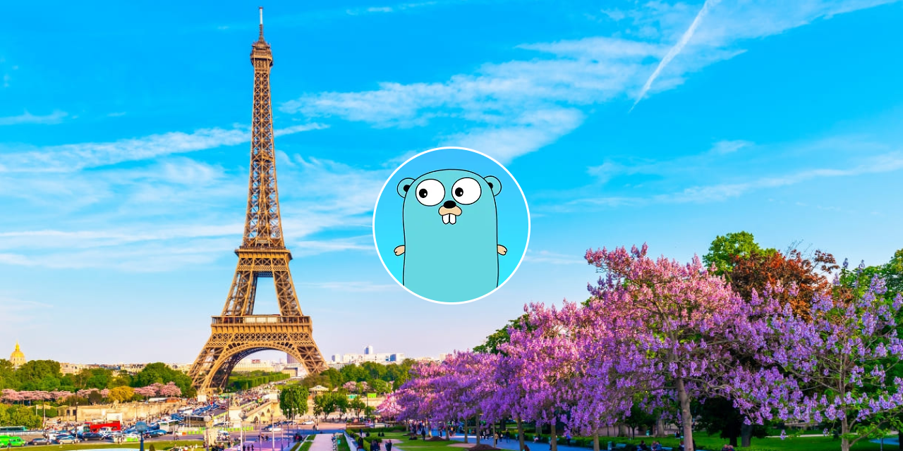

<p align="center">User-friendly module for communication with external API</p>

<div align="center">
	<a href="https://pkg.go.dev/github.com/botscommunity/botsgo">
		
	</a>
	<a href="https://www.opensource.org/licenses/MIT">
		
	</a>
    <a href="https://goreportcard.com/report/github.com/botscommunity/botsgo">
		
	</a>
</div>

<h2 align="center">Installation</h2>

```bash
go get github.com/botscommunity/botsgo
```

<h2 align="center">Getting Started</h2>

```go
package main

import (
	"context"
	"github.com/botscommunity/botsgo"
	"net/http"
)

func main() {
	client, err := botsgo.NewClient("$URL")
	if err != nil {
		panic(err)
	}

	req, err := client.NewRequest(context.TODO())
	if err != nil {
		panic(err)
	}

	response := struct{}{}

	req.Method(http.MethodGet)
	req.Path("/$path")
	req.SetHeader("Authorization", "Bearer $TOKEN")
	req.Response(&response)

	res, err := req.Do()
	if err != nil {
		panic(err)
	}

	if err := res.Body.Close(); err != nil {
		panic(err)
	}
}
```

<h2 align="center">Help in solving problems</h2>

Join our friendly community where we collaborate on bot development. Feel free to ask questions in [our chat rooms](./CONTACTS.md) and share your thoughts.